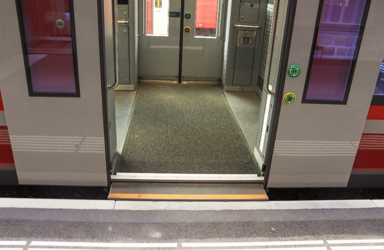

+++
title = "Der lange Weg zur Behindertengleichstellung im öffentlichen Verkehr"
date = "2023-06-28"
draft = false
pinned = true
tags = ["Deutsch", "Reportage"]
image = "ewieinstieg.jpg"
+++



2004 wurde in der Schweiz ein neues Gesetz beschlossen, welches das alltägliche Leben für Menschen mit Beeinträchtigung erheblich erleichtern sollte. Doch bei dessen Umsetzung hapert es noch. Warum ist das so? Dieser Frage haben wir uns in dieser Reportage angenommen.



**Von Luis Tschirren und Ernesto Mellado Garcia**

Sie kennen dieses Gefühl bestimmt – Sie unternehmen eine Reise in der Schweiz mit dem öffentlichen Verkehr und beim Einstieg ins Transportmittel müssen Sie ungewohnt hohe Stufen überwinden. In der Schweiz gehören nicht behindertengerechte Transportmittel noch zum Alltag. Warum «noch»? Dies liegt am Behindertengleichstellungsgesetz (BehiG), die Umsetzungsfrist läuft bis zum 31.12.2023. Laut der Webseite des Bundesamts für Verkehr (BAV) sind von gesamthaft rund 1800 Bahnhöfen und Haltestellen nur deren 928 bereits dem BehiG entsprechend umgebaut. Bei 541 ist allerdings bereits bekannt, dass die Anpassungen erst nach 2023 fertiggestellt sein werden. Da grosse Bahnhöfe jedoch prioritär umgebaut werden, können voraussichtlich bis zum Ende der zwanzigjährigen BehiG-Umsetzungsfrist Ende 2023 82% aller Passagiere hindernisfrei reisen.

Doch wie kommt es dazu, dass verschiedene Transportunternehmen bei der Umsetzung dieses Gesetzes dermassen im Verzug sind? Auf der Suche nach Antworten haben wir ein interessantes Gespräch mit Michael Müller, Mediensprecher des BAV, führen können.

**Was ist das Behindertengleichstellungsgesetz (BehiG)?**

Das Behindertengleichstellungsgesetz ist ein Bundesgesetz über die Beseitigung der Diskriminierung von beeinträchtigten Menschen im öffentlichen Raum. Dieses Gesetz trat am 1. Januar 2004 in Kraft, die Umsetzungsfrist beträgt 20 Jahre. Das auch als BehiG bekannte Gesetz verpflichtet öffentliche und private Stellen dazu, Menschen mit Behinderungen vor Diskriminierung zu schützen und ihnen ein selbstbestimmtes Leben zu ermöglichen. Es legt fest, dass Menschen mit Behinderungen das Recht haben, gleichberechtigt am gesellschaftlichen Leben teilzunehmen und Zugang zu Bildung, Arbeit, Gesundheitsversorgung, Wohnraum, Transport und Freizeitaktivitäten zu haben.

In Bezug auf den ÖV, schreibt das BehiG vor, dass bis zum 31.12.2023 ein selbstständiges Reisen von beeinträchtigten Personen möglich ist. Dazu gehören beispielsweise rollstuhlgerechte Fahrzeuge, barrierefreie Haltestellen und Informationen in leicht verständlicher Sprache. Nach aktuellem Stand werden die Vorgaben dieses Gesetzes aber mit reichlich Verspätung umgesetzt.

Die Umbauten der Infrastruktur sind oftmals sehr tiefgreifend – in den meisten Fällen braucht es deutlich mehr als nur ein neues Perron. Beispielsweise müssen oftmals neue Unterführungen errichtet werden, welche einerseits teuer sind und andererseits auch kompliziert zu bauen sind – möglichst ohne Unterbruch des Bahnverkehrs. Andererseits wird auch darauf geachtet, dass Umbauten erst in Angriff genommen werden, wenn die aktuelle Infrastruktur (d.h. Gleise, Perrons, sonstige Einrichtungen) an ihrem Lebensende angelangt sind. Und die Bahninfrastruktur ist relativ robust. Ein grosser Teil der Bahninfrastruktur ist beim Ersatz über 40 Jahre alt!

«Die BehiG-Umbaumassnahmen sind relativ tiefgreifende Massnahmen. Es braucht neue Bahnhofzugänge, Erhöhungen von Perrons, teilweise breitere Perrons und Sicherheitsmassnahmen. All das sind Baumassnahmen, welche tief in das Geschehen eines Bahnhofes eingreifen.», sagt Herr Müller.

``

Michael Müller ist seit April 2019 Mediensprecher des BAV.  Er studierte Geschichte und Politikwissenschaft an der Universität Bern. Seine Karriere begann als Politologe und Historiker, später dann als Redaktor bei der Tageszeitung «Der Bund», und anschliessend als Informationsbeauftragter im Bundesamt für Strassen. 

Zudem hatten wir auch die Möglichkeit, ein Interview mit der Leiterin der Abteilung Gleichstellung bei Inclusion Handicap, Caroline Hess-Klein zu führen. Sie studierte Jura und hat in dieser Fakultät auch einen Doktortitel erlangt.  Inclusion Handicap setzt sich für die Sensibilisierung der Gesellschaft und die Schaffung von barrierefreien Umgebungen ein. Sie ist die Dachorganisation der Schweizer Behindertenorganisationen, oder auch «die vereinte Stimme der 1.7 Millionen Menschen mit Behinderungen in der Schweiz», wie auf deren Website zu lesen ist. Daher setzen sie sich auch sehr stark für die Umsetzung des BehiG ein.

``

**Interview mit Herr Müller vom BAV:**

*Luis: Laut der Webseite von der SBB sind erst 434 von 764 Bahnhöfen BehiG-konform. Warum ist diese Zahl so tief, obwohl die Umsetzungsfrist 20 Jahre gedauert hat?*

*Herr Müller: BehiG-Umbaumassnahmen sind ziemlich tiefgreifend. Es braucht neue Bahnhofzugänge, Unterführungen, Erhöhungen von Perrons, eventuell Personenaufzüge und verstärkte Sicherheitsmassnahmen. All das sind Baumassnahmen, welche tief in die Substanz eines Bahnhofes eingreifen. Und weil dies so tiefgreifende und teure Baumassnahmen sind, warten die SBB oder auch die anderen Infrastrukturbetreiberinnen und Immobilienbesitzer mit diesen Umbauten, bis sie mit anderem Ausbau und Unterhaltsmassnahmen kombiniert werden können. Das ist der eine Grund. Der andere Grund ist, das muss man auch sagen, dass viele Unternehmen dem Thema lange Zeit nicht die nötige Aufmerksamkeit schenkten; andere Dinge waren ihnen dringender und vielleicht auch publikumswirksamer und darum haben sie möglicherweise hier und da die Ernsthaftigkeit oder den Termin einfach falsch eingeschätzt.*

*\[…]*

*Luis: Und gibt es auch bereits ein Datum, an welchem man damit rechnen kann, dass die BehiG-Umbauten alle abgeschlossen sind?*

*Herr Müller: Nein, das gibt es nicht. Es gibt die Frist, die Ende 2023 ausläuft. Wenn die Massnahmen bis dann nicht umgesetzt werden können, müssen die Bahnen eine Ersatzlösung anbieten. In der Regel ist das eine Hilfestellung durch das Personal.*

``

Die Schweiz ist bekannt für ihren herausragenden öffentlichen Verkehr. Dazu gehört auch, dass sich die Infrastruktur stets in einem guten Zustand befindet. Um nun bei den barrierefreien Ausbauten nicht unnötiges Geld auszugeben, wird ein Bahnhof beispielsweise erst dann saniert, wenn er sich in einem Zustand befindet, wo eine Sanierung nicht mehr aufschiebbar ist. Zudem erfordert die Barrierefreiheit je nach Projekt mehr oder weniger tiefgreifende Umbauten: Manchmal reicht ein neuer Bahnsteig, manchmal müssen zudem noch neue Perronzugänge (beispielsweise Unterführungen oder Passerellen) erbaut werden. Und je grösser ein Umbau ist, desto länger dauert die Planung.

Somit ist klar - die Behindertengerechtigkeit kommt nicht nur den beeinträchtigten Personen zugute, auch beispielsweise Personen mit schwerem Gepäck, Schwangere oder Eltern mit Kinderwagen werden durch barrierefreies Reisen entlastet.

**Die Stimme von Inclusion Handicap**

Doch genau diese Gruppen haben durch die teilweise stark verspätete Umsetzung nun das Nachsehen. Was bedeutet das für beeinträchtigte Personen, dass sich die Umsetzung des BehiG im Verzug befindet? Um darüber mehr zu erfahren, haben wir ein Gespräch mit Caroline Hess-Klein geführt. Sie ist Abteilungsleiterin Gleichstellung von Inclusion Handicap. Inclusion Handicap kümmert sich für Inklusion von Beeinträchtigten sowie für den Schutz deren Rechte ein.

Laut Inclusion Handicap war das grösste Problem, dass das BAV die Umsetzung des BehiGs komplett den einzelnen Transportunternehmen überlassen hatte. Dies führte dazu, dass die meisten Transportunternehmen die Frist nicht realisierten und daher manche Bahnhöfe und Haltestellen erst nach 2030 konform sein werden, mehr als 7 Jahre nach dem Ende der Frist. Warum dies so weit kommen konnte, wurde uns so erklärt: «Die Eidgenössische Finanzkontrolle (EFK) \[…] hat untersucht, wie das BehiG umgesetzt wird und ob das BAV seine Aufgaben war nimmt. Und die EFK ist zum Schluss gekommen, dass es so nicht gehe \[…]. Und ab dann hat das BAV die Schraube zugezogen, aber bis dahin hat das BAV auch weitgehend gesagt: Das sind die Unternehmen und zugeschaut, dass eine Frist einfach nichts bewirkt.» 

Der Tenor vonseiten Inclusion Handicap ist klar: Bei der Umsetzung des BehiG wurde schlichtweg geschlafen und die Folgen davon haben nun die eigentlichen Profiteure dieses Gesetzes zu tragen. Die Hilfestellungen – von welchen oben bereits die Rede war - für beeinträchtigte Personen werden wie folgt aussehen: Einerseits werden an betroffenen Orten Hilfspersonen anwesend sein, um hilfsbedürftigen Personen zu helfen. Andererseits werden auch sogenannte Mobillifte (Hublifte für Rollstühle) weiterhin eingesetzt. Diese kommen in der Schweiz bereits vielerorts zur Anwendung.

Aber was kann Inclusion Handicap tun, damit die Rechte von Menschen mit Behinderungen ernst genommen werden? Organisationen wie Inclusion Handicap haben das Verbandsklagerecht, welches anerkannten Verbänden ermöglicht, im Namen betroffener Personen juristische Schritte einzuleiten.

**Die Realität vor Ort: Erfahrungen auf einer Tagesreise durch die Schweiz**

Doch wie sieht der Umbaustand aktuell aus, wenn man eine Tagesreise durch die Schweiz unternimmt? Ich – Luis – unternahm am 7. Mai eine Reise durch die Schweiz von Bern auf den Berninapass.

Um es vorneweg zu nehmen: Die von mir festgehaltenen Eindrücke sind keineswegs repräsentativ für die ganze Schweiz, da auf der Reise nur ein kleiner Teil der Schweizer Bahnwelt tatsächlich erkundet wurde.

BehiG-seitige, erste Mängel fallen schon bald auf: am Bahnhof Bern. Dort ist ein autonomer Einstieg von beeinträchtigten Personen mangels genügend hoher Perronkanten in den meisten Fällen nicht möglich. Immerhin: Die Modernisierungsarbeiten dieses Bahnhofs laufen bereits, die hintersten Gleise sind bereits vollkommen hindernisfrei nutzbar.

Um 06:02 verliess mein Intercity den Bahnhof Bern, nächster Halt ist Zürich. Der Zug – er hört auf den Namen IC2000 und wurde Ende der 90er-Jahre gebaut – ist durchwegs mit niederflurigen Einstiegen versehen, ein Rollstuhlabteil mit behindertengerechtem WC findet sich allerdings nur in einem Wagen am Zugsende. Diese Wagen werden aktuell modernisiert und dabei werden auch weitere Wagen vollständig behindertengerecht ausgestattet. Der Unterschied zwischen den beiden Bahnhöfen ist frappant wie Tag und Nacht. In Zürich sind nämlich sämtliche Zugänge zu den Zügen vollkommen hindernisfrei nutzbar und alle Perrons sind mit der erforderlichen Perronhöhe von 55cm ausgestattet. In Zürich muss allerdings auf einen Zug umgestiegen werden, welcher reinweg Einstiege mit hohen Trittstufen unmöglich macht – als beeinträchtigte Person im Rollstuhl, mit der Absicht diesen Zug zu nutzen, muss man sich im Voraus anmelden. Allerdings ist auf der Relation Zürich-Chur genügend Auswahl mit sich überschneidenden Linien vorhanden, sodass auch hier das hindernisfreie Reisen gewährleistet ist.

In Chur wird erneut umgestiegen: Auf die RhB – ausgeschrieben Rhätische Bahn, auch bekannt als «die kleine Rote». Der Zug, den ich von Chur bis St. Moritz nutze, ist seit dem Jahr 2017 im Bündnerland unterwegs und besitzt auch in zwei Wagen niederflurige Einstiege mit Rollstuhlabteilen – somit wird auch hier dem BehiG Rechnung getragen. Diese Bahn ist weit über die Landesgrenzen bekannt, kann sie doch mit Panoramazügen aufwarten, welche klingende Namen wie «Glacier Express» oder «Bernina Express» tragen, ferner ist die Albula- und Berninalinie seit 2008 mit dem UNESCO-Weltkulturerbetitel geschützt.

Auch bei der RhB ist der Stand bei den BehiG-Ausbauten auf der besagten Strecke zu einem grossen Teil weit fortgeschritten, nur einzelne Bahnhöfe sind noch unangetastet, einige weitere befinden sich im Umbau. Dabei muss ich jedoch auch von meinen persönlichen Beobachtungen von anderen Ausflügen anmerken, dass der Ausbaustand abseits der Albula-Hauptstrecke längst nicht überall so fortgeschritten ist.

Ein weiteres Mal umsteigen muss ich im mondänen Ferienort St. Moritz im Oberengadin. Auf dieser Reiseetappe ist die Umsetzung des BehiG an einem ganz anderen Punkt als auf sämtlichen Etappen zuvor. Zwar ist auch in diesem Zug ein – zugegebenermassen eher kleines – Rollstuhlabteil vorhanden, der restliche Zug besteht aber aus altem Rollmaterial mit hohen und engen Einstiegen. Insgesamt scheinen aber sowohl Rollmaterial der RhB als auch Infrastruktur gepflegt und das Reisen im Kanton Graubünden wird – zusammen mit wunderschönen Strecken – zu einem wahren Erlebnis.

Deutlich ist zudem erkennbar, wie die Prioritäten landauf landab grösstenteils so gesetzt werden, dass möglichst viele Menschen davon profitieren können: Grosse Knotenbahnhöfe wie Zürich, Chur, sowie Samedan und St. Moritz im Bündnerland sind seit Jahren barrierefrei benutzbar.

**Wie geht es nun weiter?**

Von Seiten des BAV sind für Transportunternehmen, die das BehiG nicht rechtzeitig umsetzen, keine Strafen vorgesehen. «Das Gesetz erlaubt es nicht, dass das BAV Strafen aussprechen könnte, aber die Behindertenverbände oder einzelne Personen haben ein Klage- oder ein Verbandsbeschwerderecht», sagt Herr Müller. Einzel- und Verbandsbeschwerden mögen auf den ersten Blick vielleicht harmlos klingen, allerdings gab es in der Vergangenheit bereits eine Klage von Inclusion Handicap gegen die SBB: Bei den neuen, ab 2013 gelieferten Twindexx-Zügen der SBB wurden nämlich einige Mängel festgestellt, welche beeinträchtigten Personen das Benützen dieses Zuges erschwerten. Das Entdecken dieser Mängel führte dann zu einem Prozess, welcher sich über fast 2 Jahre hinzog. Am Ende bekam Inclusion Handicap vor Gericht Recht, was einen gewaltigen Sieg für diese Organisation bedeutet.

Doch wann werden die BehiG-Ausbauten abgeschlossen sein? Darauf weiss auch Michael Müller keine Antwort. «Es gibt kein Datum. Für diesen Bahnhof gilt vielleicht dieses Jahr, für diese Bahnunternehmung gilt ein anderes Jahr.» Somit kann man nur eines sagen: Die Umsetzung befindet sich zwar im Verzug, trotzdem geht es weiterhin vorwärts.